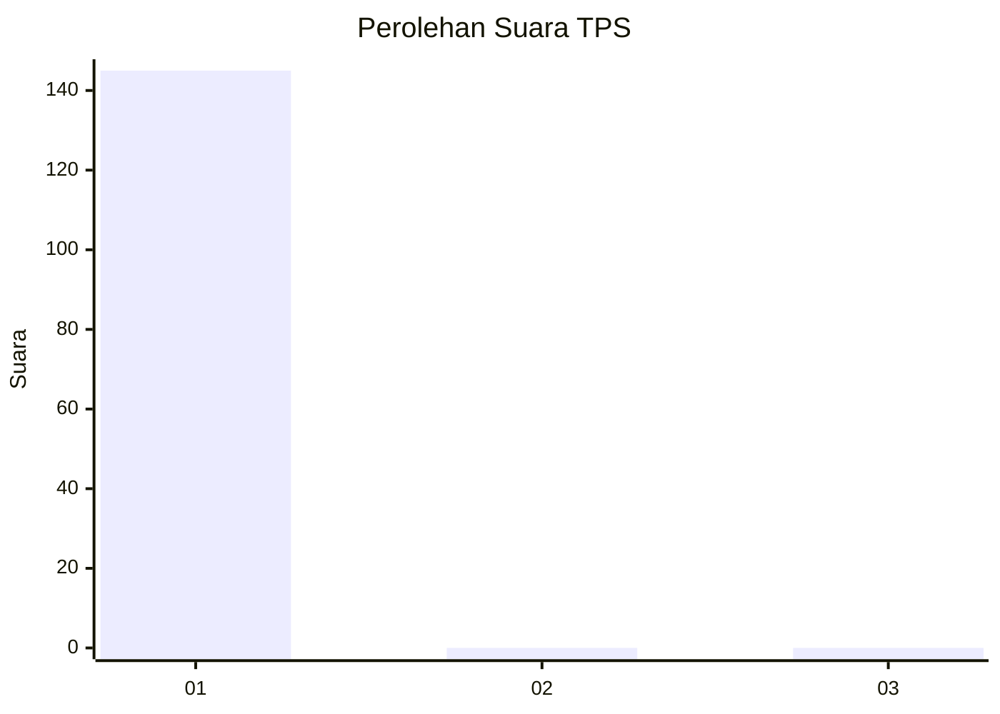
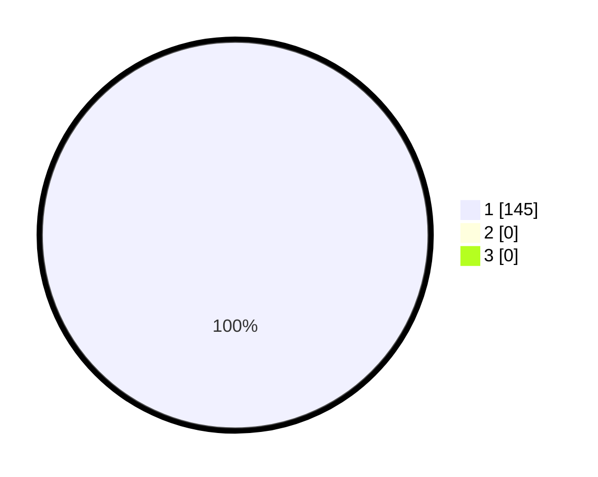

# Hasil

## Grafik

## Tabel

| No. | Nama Paslon    | Suara | Suara (raw) | Persentase |
|:--- |:-------------- | -----:| -----------:| ----------:|
| 1   | ANIES MUHAIMIN | 145   | [145][p-1]  | 100,00     |
| 2   | PRABOWO GIBRAN | 0     | [0][p-2]    | 0,00       |
| 3   | GANJAR MAHFUD  | 0     | [0][p-3]    | 0,00       |

[p-1]: https://github.com/gigit-pemilu/pemilu-2024-95-papua-pegunungan/blob/main/pilpres/hitung-suara/sub/95-papua-pegunungan/sub/01-jayawijaya/sub/30-silo-karno-doga/sub/2006-gigilobo/sub/001-tps/sub/paslon-1.txt
[p-2]: https://github.com/gigit-pemilu/pemilu-2024-95-papua-pegunungan/blob/main/pilpres/hitung-suara/sub/95-papua-pegunungan/sub/01-jayawijaya/sub/30-silo-karno-doga/sub/2006-gigilobo/sub/001-tps/sub/paslon-2.txt
[p-3]: https://github.com/gigit-pemilu/pemilu-2024-95-papua-pegunungan/blob/main/pilpres/hitung-suara/sub/95-papua-pegunungan/sub/01-jayawijaya/sub/30-silo-karno-doga/sub/2006-gigilobo/sub/001-tps/sub/paslon-3.txt

## Foto C Plano

https://sirekap-obj-formc.kpu.go.id/c424/pemilu/ppwp/95/01/30/20/06/9501302006001-20240217-163951--c71d8307-ac61-41d1-86b2-30b7787a5737.jpg

https://sirekap-obj-formc.kpu.go.id/c424/pemilu/ppwp/95/01/30/20/06/9501302006001-20240217-163953--f3f57a40-51b2-4bda-88a0-05cb65995461.jpg

https://sirekap-obj-formc.kpu.go.id/c424/pemilu/ppwp/95/01/30/20/06/9501302006001-20240217-163952--ca45f981-20b1-4162-96c7-d01702db8175.jpg

## Metadata

| Key        | Value               |
| ---------- | ------------------- |
| Time Stamp | 2024-02-19 06:16:00 |

## DATA PEMILIH TETAP

Jumlah pemilih dalam DPT: **145**.
 * L: **59**.
 * P: **86**.

## DATA PENGGUNA HAK PILIH

Jumlah pengguna hak pilih dalam DPT: **149**.
 * L: **59**.
 * P: **86**.

Jumlah pengguna hak pilih dalam DPTb: **148**.
 * L: **59**.
 * P: **86**.

Jumlah pengguna hak pilih dalam DPK: **0**.
 * L: **0**.
 * P: **0**.

Jumlah pengguna hak pilih: **0**.
 * L: **0**.
 * P: **0**.

## JUMLAH SUARA SAH DAN TIDAK SAH

JUMLAH SELURUH SUARA SAH: **145**.

JUMLAH SUARA TIDAK SAH: **0**.

JUMLAH SELURUH SUARA SAH DAN SUARA TIDAK SAH: **145**.

