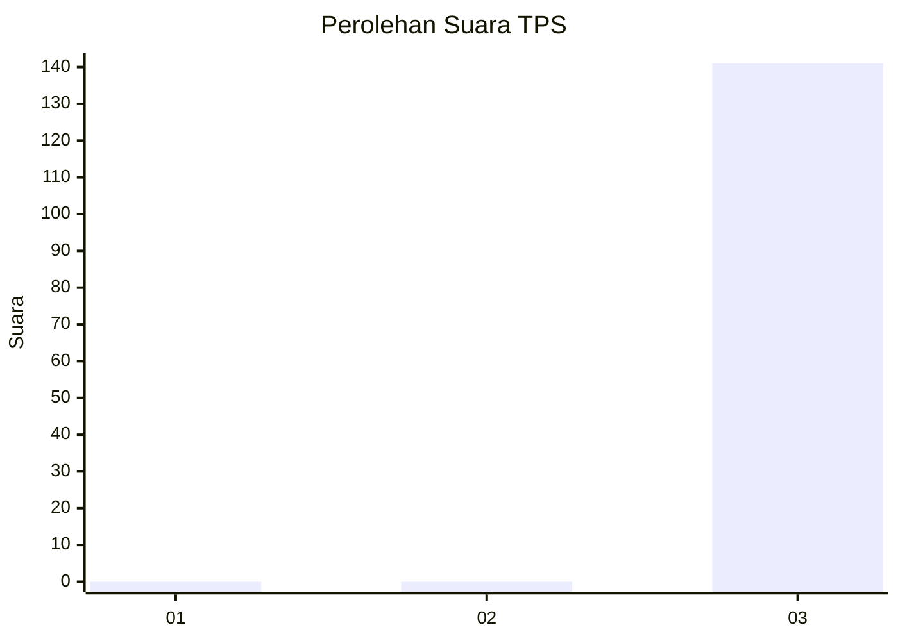
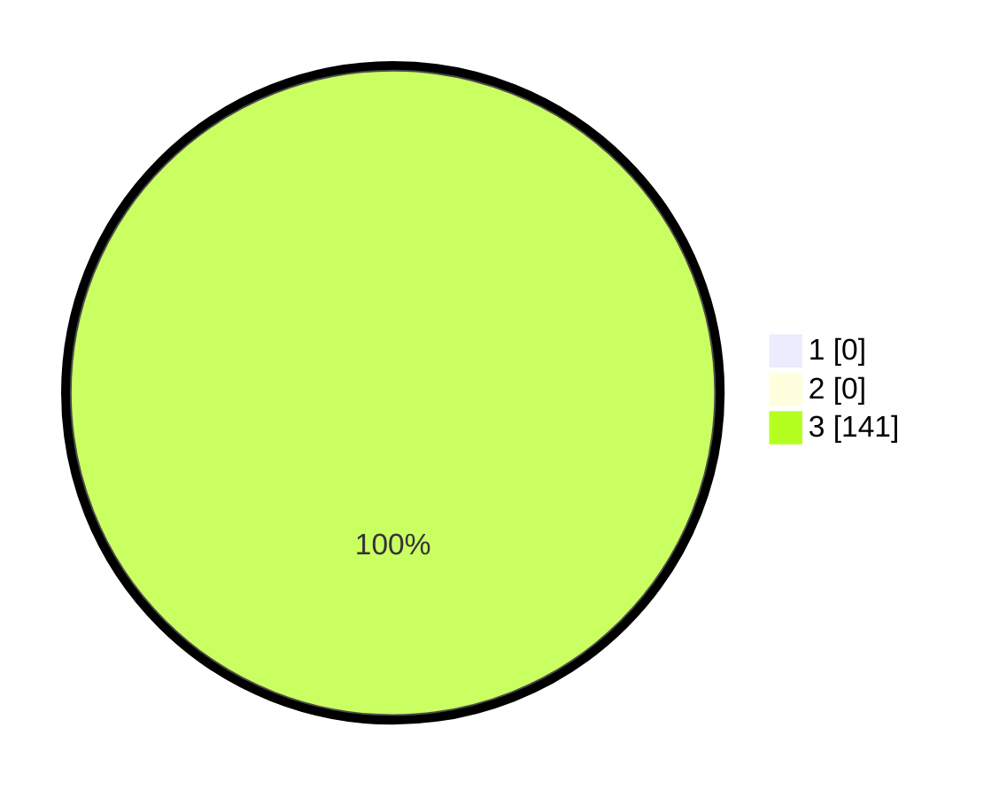

# Hasil

## Grafik

## Tabel

| No. | Nama Paslon    | Suara | Suara (raw) | Persentase |
|:--- |:-------------- | -----:| -----------:| ----------:|
| 1   | ANIES MUHAIMIN | 0     | [0][p-1]    | 0,00       |
| 2   | PRABOWO GIBRAN | 0     | [0][p-2]    | 0,00       |
| 3   | GANJAR MAHFUD  | 141   | [141][p-3]  | 100,00     |

[p-1]: https://github.com/gigit-pemilu/pemilu-2024-95-papua-pegunungan/blob/main/pilpres/hitung-suara/sub/95-papua-pegunungan/sub/01-jayawijaya/sub/30-silo-karno-doga/sub/2006-gigilobo/sub/002-tps/sub/paslon-1.txt
[p-2]: https://github.com/gigit-pemilu/pemilu-2024-95-papua-pegunungan/blob/main/pilpres/hitung-suara/sub/95-papua-pegunungan/sub/01-jayawijaya/sub/30-silo-karno-doga/sub/2006-gigilobo/sub/002-tps/sub/paslon-2.txt
[p-3]: https://github.com/gigit-pemilu/pemilu-2024-95-papua-pegunungan/blob/main/pilpres/hitung-suara/sub/95-papua-pegunungan/sub/01-jayawijaya/sub/30-silo-karno-doga/sub/2006-gigilobo/sub/002-tps/sub/paslon-3.txt

## Foto C Plano

https://sirekap-obj-formc.kpu.go.id/9a1b/pemilu/ppwp/95/01/30/20/06/9501302006002-20240217-153459--588b59fe-1408-4799-8908-0be53c552b57.jpg

https://sirekap-obj-formc.kpu.go.id/9a1b/pemilu/ppwp/95/01/30/20/06/9501302006002-20240217-153501--7dab5937-2570-4b2d-a979-8f4b5927d93f.jpg

https://sirekap-obj-formc.kpu.go.id/9a1b/pemilu/ppwp/95/01/30/20/06/9501302006002-20240217-153500--552ead4c-e661-45ad-92e7-755c45ce961b.jpg

## Metadata

| Key        | Value               |
| ---------- | ------------------- |
| Time Stamp | 2024-02-20 10:00:00 |

## DATA PEMILIH TETAP

Jumlah pemilih dalam DPT: **141**.
 * L: **69**.
 * P: **72**.

## DATA PENGGUNA HAK PILIH

Jumlah pengguna hak pilih dalam DPT: **141**.
 * L: **69**.
 * P: **72**.

Jumlah pengguna hak pilih dalam DPTb: **0**.
 * L: **0**.
 * P: **0**.

Jumlah pengguna hak pilih dalam DPK: **0**.
 * L: **0**.
 * P: **0**.

Jumlah pengguna hak pilih: **141**.
 * L: **69**.
 * P: **72**.

## JUMLAH SUARA SAH DAN TIDAK SAH

JUMLAH SELURUH SUARA SAH: **141**.

JUMLAH SUARA TIDAK SAH: **0**.

JUMLAH SELURUH SUARA SAH DAN SUARA TIDAK SAH: **141**.

