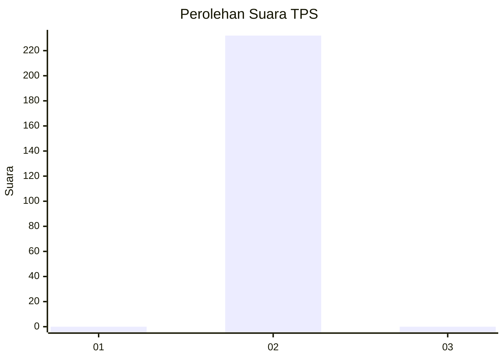
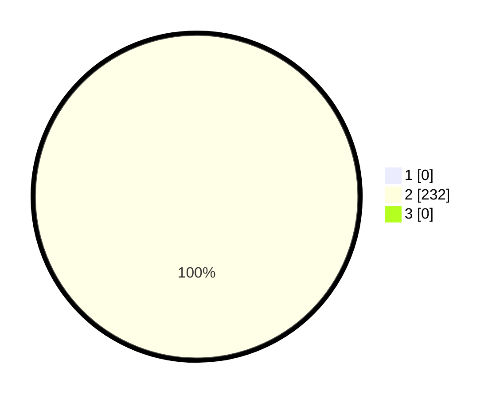

# Hasil

## Grafik

## Tabel

| No. | Nama Paslon    | Suara | Suara (raw) | Persentase |
|:--- |:-------------- | -----:| -----------:| ----------:|
| 1   | ANIES MUHAIMIN | 0     | [0][p-1]    | 0,00       |
| 2   | PRABOWO GIBRAN | 232   | [232][p-2]  | 100,00     |
| 3   | GANJAR MAHFUD  | 0     | [0][p-3]    | 0,00       |

[p-1]: https://github.com/gigit-pemilu/pemilu-2024-95-papua-pegunungan/blob/main/pilpres/hitung-suara/sub/95-papua-pegunungan/sub/05-mamberamo-tengah/sub/02-kelila/sub/2014-yagabur/sub/001-tps/sub/paslon-1.txt
[p-2]: https://github.com/gigit-pemilu/pemilu-2024-95-papua-pegunungan/blob/main/pilpres/hitung-suara/sub/95-papua-pegunungan/sub/05-mamberamo-tengah/sub/02-kelila/sub/2014-yagabur/sub/001-tps/sub/paslon-2.txt
[p-3]: https://github.com/gigit-pemilu/pemilu-2024-95-papua-pegunungan/blob/main/pilpres/hitung-suara/sub/95-papua-pegunungan/sub/05-mamberamo-tengah/sub/02-kelila/sub/2014-yagabur/sub/001-tps/sub/paslon-3.txt

## Foto C Plano

https://sirekap-obj-formc.kpu.go.id/8e8f/pemilu/ppwp/95/05/02/20/14/9505022014001-20240220-094924--b40bcb6b-1b5d-4741-a252-1165bd047575.jpg

https://sirekap-obj-formc.kpu.go.id/8e8f/pemilu/ppwp/95/05/02/20/14/9505022014001-20240220-094925--bc7c8f9d-0aac-4162-a7b9-5e48c77d97ed.jpg

https://sirekap-obj-formc.kpu.go.id/8e8f/pemilu/ppwp/95/05/02/20/14/9505022014001-20240220-094924--8add362c-485b-43e5-8a1e-de3b8e3e6d8d.jpg

## Metadata

| Key        | Value               |
| ---------- | ------------------- |
| Time Stamp | 2024-02-20 19:00:00 |

## DATA PEMILIH TETAP

Jumlah pemilih dalam DPT: **232**.
 * L: **111**.
 * P: **121**.

## DATA PENGGUNA HAK PILIH

Jumlah pengguna hak pilih dalam DPT: **232**.
 * L: **111**.
 * P: **121**.

Jumlah pengguna hak pilih dalam DPTb: **0**.
 * L: **0**.
 * P: **0**.

Jumlah pengguna hak pilih dalam DPK: **0**.
 * L: **0**.
 * P: **0**.

Jumlah pengguna hak pilih: **232**.
 * L: **111**.
 * P: **121**.

## JUMLAH SUARA SAH DAN TIDAK SAH

JUMLAH SELURUH SUARA SAH: **232**.

JUMLAH SUARA TIDAK SAH: **0**.

JUMLAH SELURUH SUARA SAH DAN SUARA TIDAK SAH: **232**.

